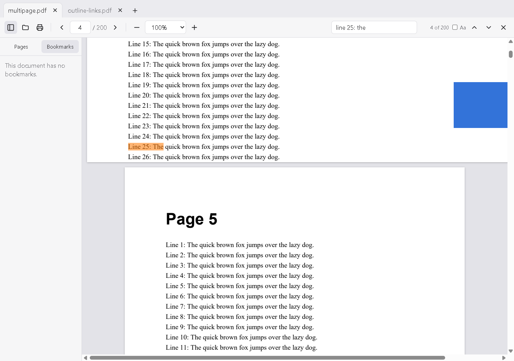

# Yet Another PDF Editor

A lightweight, open-source PDF viewer and editor for Windows (macOS and Linux later).
It's built with Tauri 2, Svelte 5 and PDFium. See [docs/ROADMAP.md](docs/ROADMAP.md) for the plan.



## Features
- **View:** tabs, thumbnails, bookmarks, search (Ctrl+F), text selection and copy, links, zoom, print,
  password-protected PDFs, recent files, opens `.pdf` files from Explorer
- **Edit (Ctrl+E):** double-click text to edit it in place (keeps the original fonts where possible),
  move/delete text blocks, add text, replace/move/resize/delete/add images
- **Comment:** highlight, underline, strikethrough, sticky notes, freehand pen, rectangles, ellipses
- **Fill & sign:** fill form fields (text, checkboxes, radio buttons, drop-downs); draw, type or upload a signature
- **Pages:** rotate, delete, reorder by dragging thumbnails, insert blank pages, pages from another PDF
  (merge) or images, extract pages to a new PDF, split into several files
- **Protect & shrink:** password protection (AES-256), reduce file size, true redaction
- **Export:** pages as PNG/JPEG; document properties
- **Undo/redo** (Ctrl+Z / Ctrl+Y), **save** (Ctrl+S) and **save as** (Ctrl+Shift+S), with automatic backups

## Download
Installers for Windows, macOS and Linux are on the
[Releases](https://github.com/uaip-dev/yet-another-pdf-editor/releases) page. Installed copies
update themselves.

## Prerequisites (Windows)
- [Rust](https://rustup.rs) (stable, MSVC toolchain) and Visual Studio C++ Build Tools
- Node.js 20+ and pnpm
- WebView2 (preinstalled on Windows 10/11)

## Setup
```powershell
pnpm install
./scripts/fetch-pdfium.ps1   # Windows: downloads pdfium.dll into src-tauri/pdfium/
# macOS/Linux: ./scripts/fetch-pdfium.sh mac-arm64 | mac-x64 | linux-x64
```

## Run / build
```powershell
pnpm tauri dev      # development
pnpm tauri build    # release installers (NSIS + MSI) in src-tauri/target/release/bundle
```

## Releasing
1. Bump `version` in `package.json`, `src-tauri/Cargo.toml` and `src-tauri/tauri.conf.json`.
2. Push a tag: `git tag v0.2.0 && git push origin v0.2.0`.
3. GitHub Actions builds every platform into a draft release; publish it to ship the update.

The update signing key must be in the repository secret `TAURI_SIGNING_PRIVATE_KEY`
(Settings → Secrets and variables → Actions).

## Layout
- `src/` — Svelte UI (`lib/PdfView.svelte` is the virtualized page view, `lib/api.ts` wraps the IPC calls)
- `src-tauri/src/engine.rs` — PDFium worker thread (open, render, and later edit)
- `src-tauri/src/lib.rs` — Tauri commands

## License
MIT. PDFium is BSD-3-Clause / Apache-2.0.
